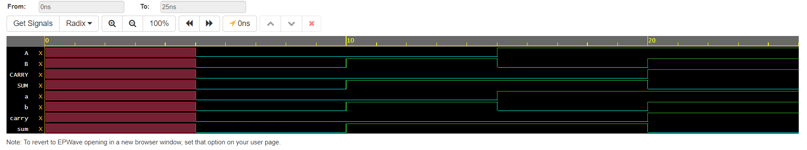

<h1 align="center"><b> Half Adder</b></h1>

Half adder is a combinational circuit, that sums two single bit binary numbers.  
No. of inputs =2  
No. of outputs=2  

The output sum is the least significant bit (LSB) of the result.
The output carry is the most significant bit (MSB) of the result.

# Logic Circuit Diagram

# Truth Table 
|Input A|Input B|Output Sum|Output Carry|
|----|-----|-------|----|
|0|0|0|0|
|0|1|1|0|
|1|0|1|0|
|1|1|0|1|

# Logical Expression
Sum= A XOR B ( Or can be written as A(B!)+(A!)B
Carry = A AND B

# Result Waveform

