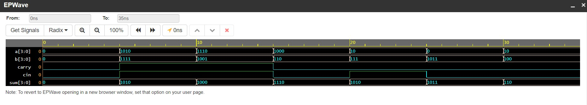

<h1 align="center"><b>4-bit Ripple Carry Adder</b></h1>

A ripple carry adder is a combinational circuit which works in stages. It is also known as <b>n-bit parallel adder</b>.The carry out produced by each full adder serves as carry-in for its adjacent most significant full adder. 
Ripple Carry Adder does not allow to use all the full adders simultaneously.
The circuit has increased propagation time and are extremely slow.

# Logical Diagram 

# Truth Table 
| A0 	| B0 	| Cin 	| S0 	|   	| C0 	| A1 	| B1 	| S1 	|   	| C1 	| A2 	| B2 	| S2 	|   	| C2 	| A3 	| B3 	| S3 	| C3 	|
|----	|----	|-----	|----	|---	|----	|----	|----	|----	|---	|----	|----	|----	|----	|---	|----	|----	|----	|----	|----	|
| 0  	| 0  	| 0   	| 0  	|   	| 0  	| 0  	| 0  	| 0  	|   	| 0  	| 0  	| 0  	| 0  	|   	| 0  	| 0  	| 0  	| 0  	| 0  	|
| 0  	| 0  	| 1   	| 1  	|   	| 0  	| 0  	| 1  	| 1  	|   	| 0  	| 0  	| 1  	| 1  	|   	| 0  	| 0  	| 1  	| 1  	| 0  	|
| 0  	| 1  	| 0   	| 1  	|   	| 0  	| 1  	| 0  	| 1  	|   	| 0  	| 1  	| 0  	| 1  	|   	| 0  	| 1  	| 0  	| 1  	| 0  	|
| 0  	| 1  	| 1   	| 0  	|   	| 1  	| 0  	| 0  	| 1  	|   	| 0  	| 1  	| 1  	| 0  	|   	| 1  	| 0  	| 0  	| 1  	| 0  	|
| 1  	| 0  	| 0   	| 1  	|   	| 0  	| 1  	| 1  	| 0  	|   	| 1  	| 0  	| 0  	| 1  	|   	| 0  	| 1  	| 1  	| 0  	| 1  	|
| 1  	| 0  	| 1   	| 0  	|   	| 1  	| 0  	| 1  	| 0  	|   	| 1  	| 0  	| 1  	| 0  	|   	| 1  	| 0  	| 1  	| 0  	| 1  	|
| 1  	| 1  	| 0   	| 0  	|   	| 1  	| 1  	| 0  	| 0  	|   	| 1  	| 1  	| 0  	| 0  	|   	| 1  	| 1  	| 0  	| 0  	| 1  	|
| 1  	| 1  	| 1   	| 1  	|   	| 1  	| 1  	| 1  	| 1  	|   	| 1  	| 1  	| 1  	| 1  	|   	| 1  	| 1  	| 1  	| 1  	| 1  	|

# Expression

S0= A0⊕B0⊕Cin
C0= (A0 & B0)⊕(A0 & Cin)⊕(B0 & Cin)

S1= A1⊕B1⊕C0
C1= (A1 & B1)⊕(A1 & C0)⊕(B1 ⊕ C0)

S2= A2⊕B2⊕C1
C2= (A2 & B2)⊕(A2 & C1)⊕(B2 & C1)

S3= A3⊕B3⊕C2
C3= (A3 & B3)⊕(A3 & C2)⊕(B3 & C2)

# EDAPLAYGROUND LINK
[PLAY](https://edaplayground.com/x/NTFS)

# Result Waveform 

