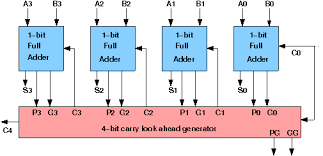
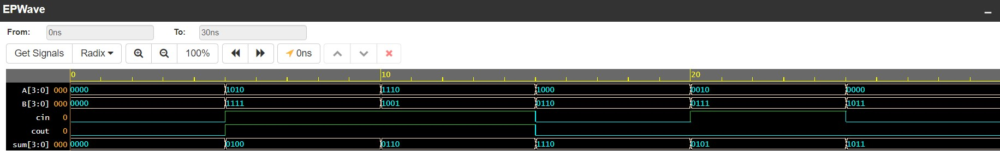

<h1 align="center"><b>4-bit CLA: Carry Look Ahead Adder</b></h1>

-It is a combinational circuit. 
-It is superior than [Ripple carry adder](https://github.com/Dhruv0Upadhyay/100_Days_of_RTL/tree/main/Day11). 
-Also known as <b>fast adder</b>.
- Works on <b>Carry Propogate{A⊕B}</b> and <b>Carry Generator{A.B}</b>. 
   Carry Propogate denoted by P. 
   Carry Generate denoted by G. 
   
# Logical Diagram 

# Expression
C0=(A0.B0)+(A0⊕B0).Cin
also - C0= G0+P0.Cin

C1=(A1.B1)+(A1⊕B1).C0
also - C1= G1+P1.C0

C2=(A2.B2)+(A2⊕B2).C1
also - C2= G2+P2.C1

C3=(A3.B3)+(A3⊕B3).C2
also - C3= G3+P3.C2

S0= P0⊕Cin
S1= P1⊕C0
S2= P2⊕C1
S3= P3⊕C2

# EDAPLAYGROUND LINK
[PLAY]([https://edaplayground.com/x/NTFS](https://www.edaplayground.com/x/QXa4))

# Result Waveform 

