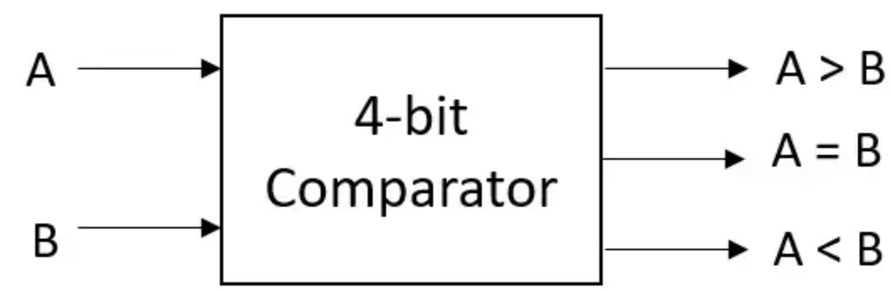
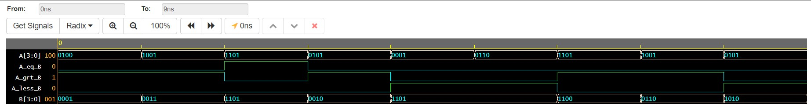

<h1 align="center"><b>4-bit Comparator</b></h1>

A 4-bit comparator is a digital circuit that compares two 4-bit binary numbers and determines their equality (equal, greater than, or less than) based on the values of the individual bits.
   
# Logical Diagram 

# EDAPLAYGROUND LINK
[PLAY](https://edaplayground.com/x/LaJh)

# Result Waveform 

