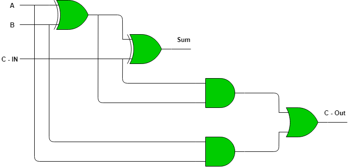
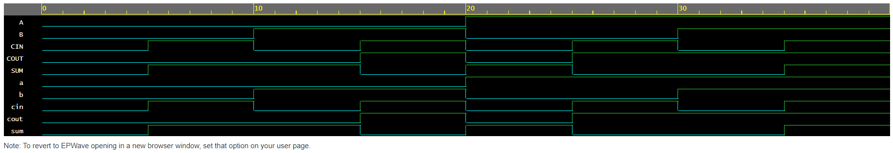

<h1 align="center"><b>Full Adder</b></h1>

Full adder is a combinational circuit, that sums three binary bits.  
No. of inputs =3  
No. of outputs=2  

The output sum is xor of the inputs. 
The output cout is obtained using *"AND"* & *"OR"* gates. 
The cicuit can be implemented by only using NAND Gate, NOR Gate or by using [Half Adder](https://github.com/Dhruv0Upadhyay/100_Days_of_RTL/tree/main/Day1) and a OR Gate.
# Logic Circuit Diagram

# Truth Table 
|Input A|Input B|Input CIN|Output Sum|Output COUT|
|----|-----|-----|-------|----|
|0|0|0|0|0|
|0|0|1|1|0|
|0|1|0|1|0|
|0|1|1|0|1|
|1|0|0|1|0|
|1|0|1|0|1|
|1|1|0|0|1|
|1|1|1|1|1|

# Logical Expression
Sum= (A XOR B) XOR C  {Or can be written as (A!)(B!)C+(A!)B(C!)+A(B!)(C!)+ABC}
COUT = AB + CIN (A XOR B) 

# Result Waveform

