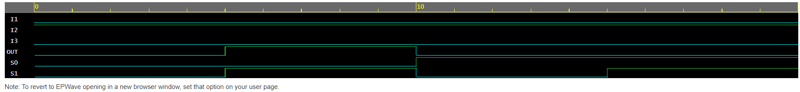

<h1 align="center"><b>3x1 Multiplexer</b></h1>

3x1 Multiplexer actually does not exist but is a combination of two 2x1 Multiplexer.
It is a combinational circuit 2 select lines and 3 inputs, but being a mux with 2 select line can represent maximum of 4 inputs. So, one select line remains unused or can be used for repetition of any input condition depends on the use-case.  
No. of inputs =3  
No. of select lines=2 
No. of outputs=1  

## What is a Multiplexer?
Multiplexer is a combinational circuit that selects one output from multiple inputs. It has n input lines, m select lines and one output line. 
Input lines depend on no. of select line, as no. of input line is equal to 2^m (where m is no. of select line). The value on the select lines determines which input line is transmitted to the output line.  

Multiplexers are used in many digital circuit applications, such as in data transmission, digital communication systems, and microprocessors. They are used to selecting data from multiple sources and route it to a single destination. Multiplexers are also used in memory addressing and in the design of arithmetic and logic units (ALUs) in microprocessors.  

# Logic Circuit Diagram

<b>Logic Diagram of 3x1 MUX</b>

# Truth Table 
|Input 1|Input 2|Input 3|Select Line S0|Select Line S1|Output|
|---|---|---|----|----|---|
|I1|0|0|0|0|I1|
|0|I2|0|0|1|I2|
|0|0|I3|1|0|I3|
|x|x|x|1|1|x|

# Result Waveform

