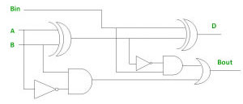

<h1 align="center"><b>Full Subtractor</b></h1>

A full subtractor is a combinational circuit that performs the subtraction of two bits along with a borrow bit from the previous stage, or in other words subtracts three one-bit number. 
The inputs to the full subtractor are the minuend (A), subtrahend (B) and the borrow (B_in) from the previous stage, and the outputs are the difference (D) and the borrow-out (B_out) for the next stage. 
No. of inputs =3  
No. of outputs=2  

# Logic Circuit Diagram

# Truth Table 
|Input A|Input B|Input Bin|Output D|Output Bout|
|---|---|---|----|----|
|0|0|0|0|0|
|0|0|1|1|1|
|0|1|0|1|1|
|0|1|1|0|1|
|1|0|0|1|0|
|1|0|1|0|0|
|1|1|0|0|0|
|1|1|1|1|1|

# Logical Expression
<b> D </b> = (A XOR B) XOR Bin {A(B!)Bin+(A!)BBin+A(B!)(Bin!)+(A!)B(Bin!)}  

<b> Bout </b> = Bin (A XOR B)’ + A’B {Bin((A!)B+A(B!))!+(A!)B}

# Result Waveform

