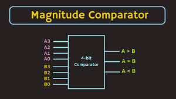
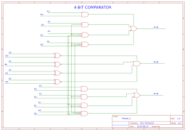

<h1 align="center"><b>4 Bit Comparators</b></h1>

A 4-bit comparator is a circuit that compares two 4-bit binary numbers and provides output whether the numbers are equal or unequal.  It consists of 8 inputs each for two four-bit numbers and three outputs to generate less than(<), equal to(=) and greater than(>) between two binary numbers. 
No. of inputs =8  
No. of outputs=3  

# Logic Circuit/Block Diagram

  

# Truth Table 
|A0|A1|A2|A3|  |B0|B1|B2|B3|  |A>B|A=B|A<B|
|--|--|--|--|--|--|--|--|--|--|--|--|--|
|0|0|0|0|  |0|0|0|0|  |0|1|0|
|0|0|0|0|  |0|0|0|1|  |0|0|1|
|0|0|0|0|  |0|0|1|0|  |0|0|1|
|0|0|0|0|  |0|0|1|1|  |0|0|1|
|0|0|0|0|  |0|1|0|0|  |0|0|1|
|0|0|0|0|  |0|1|0|1|  |0|0|1|
|0|0|0|0|  |0|1|1|0|  |0|0|1|
|0|0|0|0|  |0|1|1|1|  |0|0|1|
|0|0|0|0|  |1|0|0|0|  |0|0|1|
|0|0|0|0|  |1|0|0|1|  |0|0|1|
|0|0|0|0|  |1|0|1|0|  |0|0|1|
|0|0|0|0|  |1|0|1|1|  |0|0|1|
|0|0|0|0|  |1|1|0|0|  |0|0|1|
|0|0|0|0|  |1|1|0|1|  |0|0|1|
|0|0|0|0|  |1|1|1|0|  |0|0|1|
|0|0|0|0|  |1|1|1|1|  |0|0|1|
|0|0|0|1|  |0|0|0|0|  |1|0|0|
|0|0|0|1|  |0|0|0|1|  |0|1|0|
|0|0|0|1|  |0|0|1|0|  |0|0|1|
|0|0|0|1|  |0|0|1|1|  |0|0|1|
|0|0|0|1|  |0|1|0|0|  |0|0|1|
|0|0|0|1|  |0|1|0|1|  |0|0|1|
|0|0|0|1|  |0|1|1|0|  |0|0|1|
|0|0|0|1|  |0|1|1|1|  |0|0|1|
|0|0|0|1|  |1|0|0|0|  |0|0|1|
|0|0|0|1|  |1|0|0|1|  |0|0|1|
|0|0|0|1|  |1|0|1|0|  |0|0|1|
|0|0|0|1|  |1|0|1|1|  |0|0|1|
|0|0|0|1|  |1|1|0|0|  |0|0|1|
|0|0|0|1|  |1|1|0|1|  |0|0|1|
|0|0|0|1|  |1|1|1|0|  |0|0|1|
|0|0|0|1|  |1|1|1|1|  |0|0|1|
|0|0|1|0|  |0|0|0|0|  |1|0|0|
|0|0|1|0|  |0|0|0|1|  |1|0|0|
|0|0|1|0|  |0|0|1|0|  |0|1|0|
|0|0|1|0|  |0|0|1|1|  |0|0|1|
|0|0|1|0|  |0|1|0|0|  |0|0|1|
|0|0|1|0|  |0|1|0|1|  |0|0|1|
|0|0|1|0|  |0|1|1|0|  |0|0|1|
|0|0|1|0|  |0|1|1|1|  |0|0|1|
|0|0|1|0|  |1|0|0|0|  |0|0|1|
|0|0|1|0|  |1|0|0|1|  |0|0|1|
|0|0|1|0|  |1|0|1|0|  |0|0|1|
|0|0|1|0|  |1|0|1|1|  |0|0|1|
|0|0|1|0|  |1|1|0|0|  |0|0|1|
|0|0|1|0|  |1|1|0|1|  |0|0|1|
|0|0|1|0|  |1|1|1|0|  |0|0|1|
|0|0|1|0|  |1|1|1|1|  |0|0|1|
|0|0|1|1|  |0|0|0|0|  |1|0|0|
|0|0|1|1|  |0|0|0|1|  |1|0|0|
|0|0|1|1|  |0|0|1|0|  |1|0|0|
|0|0|1|1|  |0|0|1|1|  |0|1|0|
|0|0|1|1|  |0|1|0|0|  |0|0|1|
|0|0|1|1|  |0|1|0|1|  |0|0|1|
|0|0|1|1|  |0|1|1|0|  |0|0|1|
|0|0|1|1|  |0|1|1|1|  |0|0|1|
|0|0|1|1|  |1|0|0|0|  |0|0|1|
|0|0|1|1|  |1|0|0|1|  |0|0|1|
|0|0|1|1|  |1|0|1|0|  |0|0|1|
|0|0|1|1|  |1|0|1|1|  |0|0|1|
|0|0|1|1|  |1|1|0|0|  |0|0|1|
|0|0|1|1|  |1|1|0|1|  |0|0|1|
|0|0|1|1|  |1|1|1|0|  |0|0|1|
|0|0|1|1|  |1|1|1|1|  |0|0|1|
|0|1|0|0|  |0|0|0|0|  |1|0|0|
|0|1|0|0|  |0|0|0|1|  |1|0|0|
|0|1|0|0|  |0|0|1|0|  |1|0|0|
|0|1|0|0|  |0|0|1|1|  |1|0|0|
|0|1|0|0|  |0|1|0|0|  |0|1|0|
|0|1|0|0|  |0|1|0|1|  |0|0|1|
|0|1|0|0|  |0|1|1|0|  |0|0|1|
|0|1|0|0|  |0|1|1|1|  |0|0|1|
|0|1|0|0|  |1|0|0|0|  |0|0|1|
|0|1|0|0|  |1|0|0|1|  |0|0|1|
|0|1|0|0|  |1|0|1|0|  |0|0|1|
|0|1|0|0|  |1|0|1|1|  |0|0|1|
|0|1|0|0|  |1|1|0|0|  |0|0|1|
|0|1|0|0|  |1|1|0|1|  |0|0|1|
|0|1|0|0|  |1|1|1|0|  |0|0|1|
|0|1|0|0|  |1|1|1|1|  |0|0|1|
|0|1|0|1|  |0|0|0|0|  |1|0|0|
|0|1|0|1|  |0|0|0|1|  |1|0|0|
|0|1|0|1|  |0|0|1|0|  |1|0|0|
|0|1|0|1|  |0|0|1|1|  |1|0|0|
|0|1|0|1|  |0|1|0|0|  |1|0|0|
|0|1|0|1|  |0|1|0|1|  |0|1|0|
|0|1|0|1|  |0|1|1|0|  |0|0|1|
|0|1|0|1|  |0|1|1|1|  |0|0|1|
|0|1|0|1|  |1|0|0|0|  |0|0|1|
|0|1|0|1|  |1|0|0|1|  |0|0|1|
|0|1|0|1|  |1|0|1|0|  |0|0|1|
|0|1|0|1|  |1|0|1|1|  |0|0|1|
|0|1|0|1|  |1|1|0|0|  |0|0|1|
|0|1|0|1|  |1|1|0|1|  |0|0|1|
|0|1|0|1|  |1|1|1|0|  |0|0|1|
|0|1|0|1|  |1|1|1|1|  |0|0|1|
|0|1|1|0|  |0|0|0|0|  |1|0|0|
|0|1|1|0|  |0|0|0|1|  |1|0|0|
|0|1|1|0|  |0|0|1|0|  |1|0|0|
|0|1|1|0|  |0|0|1|1|  |1|0|0|
|0|1|1|0|  |0|1|0|0|  |1|0|0|
|0|1|1|0|  |0|1|0|1|  |1|0|0|
|0|1|1|0|  |0|1|1|0|  |0|1|0|
|0|1|1|0|  |0|1|1|1|  |0|0|1|
|0|1|1|0|  |1|0|0|0|  |0|0|1|
|0|1|1|0|  |1|0|0|1|  |0|0|1|
|0|1|1|0|  |1|0|1|0|  |0|0|1|
|0|1|1|0|  |1|0|1|1|  |0|0|1|
|0|1|1|0|  |1|1|0|0|  |0|0|1|
|0|1|1|0|  |1|1|0|1|  |0|0|1|
|0|1|1|0|  |1|1|1|0|  |0|0|1|
|0|1|1|0|  |1|1|1|1|  |0|0|1|
|0|1|1|1|  |0|0|0|0|  |1|0|0|
|0|1|1|1|  |0|0|0|1|  |1|0|0|
|0|1|1|1|  |0|0|1|0|  |1|0|0|
|0|1|1|1|  |0|0|1|1|  |1|0|0|
|0|1|1|1|  |0|1|0|0|  |1|0|0|
|0|1|1|1|  |0|1|0|1|  |1|0|0|
|0|1|1|1|  |0|1|1|0|  |1|0|0|
|0|1|1|1|  |0|1|1|1|  |0|1|0|
|0|1|1|1|  |1|0|0|0|  |0|0|1|
|0|1|1|1|  |1|0|0|1|  |0|0|1|
|0|1|1|1|  |1|0|1|0|  |0|0|1|
|0|1|1|1|  |1|0|1|1|  |0|0|1|
|0|1|1|1|  |1|1|0|0|  |0|0|1|
|0|1|1|1|  |1|1|0|1|  |0|0|1|
|0|1|1|1|  |1|1|1|0|  |0|0|1|
|0|1|1|1|  |1|1|1|1|  |0|0|1|
|1|0|0|0|  |0|0|0|0|  |1|0|0|
|1|0|0|0|  |0|0|0|1|  |1|0|0|
|1|0|0|0|  |0|0|1|0|  |1|0|0|
|1|0|0|0|  |0|0|1|1|  |1|0|0|
|1|0|0|0|  |0|1|0|0|  |1|0|0|
|1|0|0|0|  |0|1|0|1|  |1|0|0|
|1|0|0|0|  |0|1|1|0|  |1|0|0|
|1|0|0|0|  |0|1|1|1|  |1|0|0|
|1|0|0|0|  |1|0|0|0|  |0|1|0|
|1|0|0|0|  |1|0|0|1|  |0|0|1|
|1|0|0|0|  |1|0|1|0|  |0|0|1|
|1|0|0|0|  |1|0|1|1|  |0|0|1|
|1|0|0|0|  |1|1|0|0|  |0|0|1|
|1|0|0|0|  |1|1|0|1|  |0|0|1|
|1|0|0|0|  |1|1|1|0|  |0|0|1|
|1|0|0|0|  |1|1|1|1|  |0|0|1|
|1|0|0|1|  |0|0|0|0|  |1|0|0|
|1|0|0|1|  |0|0|0|1|  |1|0|0|
|1|0|0|1|  |0|0|1|0|  |1|0|0|
|1|0|0|1|  |0|0|1|1|  |1|0|0|
|1|0|0|1|  |0|1|0|0|  |1|0|0|
|1|0|0|1|  |0|1|0|1|  |1|0|0|
|1|0|0|1|  |0|1|1|0|  |1|0|0|
|1|0|0|1|  |0|1|1|1|  |1|0|0|
|1|0|0|1|  |1|0|0|0|  |1|0|0|
|1|0|0|1|  |1|0|0|1|  |0|1|0|
|1|0|0|1|  |1|0|1|0|  |0|0|1|
|1|0|0|1|  |1|0|1|1|  |0|0|1|
|1|0|0|1|  |1|1|0|0|  |0|0|1|
|1|0|0|1|  |1|1|0|1|  |0|0|1|
|1|0|0|1|  |1|1|1|0|  |0|0|1|
|1|0|0|1|  |1|1|1|1|  |0|0|1|
|1|0|1|0|  |0|0|0|0|  |1|0|0|
|1|0|1|0|  |0|0|0|1|  |1|0|0|
|1|0|1|0|  |0|0|1|0|  |1|0|0|
|1|0|1|0|  |0|0|1|1|  |1|0|0|
|1|0|1|0|  |0|1|0|0|  |1|0|0|
|1|0|1|0|  |0|1|0|1|  |1|0|0|
|1|0|1|0|  |0|1|1|0|  |1|0|0|
|1|0|1|0|  |0|1|1|1|  |1|0|0|
|1|0|1|0|  |1|0|0|0|  |1|0|0|
|1|0|1|0|  |1|0|0|1|  |1|0|0|
|1|0|1|0|  |1|0|1|0|  |0|1|0|
|1|0|1|0|  |1|0|1|1|  |0|0|1|
|1|0|1|0|  |1|1|0|0|  |0|0|1|
|1|0|1|0|  |1|1|0|1|  |0|0|1|
|1|0|1|0|  |1|1|1|0|  |0|0|1|
|1|0|1|0|  |1|1|1|1|  |0|0|1|
|1|0|1|1|  |0|0|0|0|  |1|0|0|
|1|0|1|1|  |0|0|0|1|  |1|0|0|
|1|0|1|1|  |0|0|1|0|  |1|0|0|
|1|0|1|1|  |0|0|1|1|  |1|0|0|
|1|0|1|1|  |0|1|0|0|  |1|0|0|
|1|0|1|1|  |0|1|0|1|  |1|0|0|
|1|0|1|1|  |0|1|1|0|  |1|0|0|
|1|0|1|1|  |0|1|1|1|  |1|0|0|
|1|0|1|1|  |1|0|0|0|  |1|0|0|
|1|0|1|1|  |1|0|0|1|  |1|0|0|
|1|0|1|1|  |1|0|1|0|  |1|0|0|
|1|0|1|1|  |1|0|1|1|  |0|1|0|
|1|0|1|1|  |1|1|0|0|  |0|0|1|
|1|0|1|1|  |1|1|0|1|  |0|0|1|
|1|0|1|1|  |1|1|1|0|  |0|0|1|
|1|0|1|1|  |1|1|1|1|  |0|0|1|
|1|1|0|0|  |0|0|0|0|  |1|0|0|
|1|1|0|0|  |0|0|0|1|  |1|0|0|
|1|1|0|0|  |0|0|1|0|  |1|0|0|
|1|1|0|0|  |0|0|1|1|  |1|0|0|
|1|1|0|0|  |0|1|0|0|  |1|0|0|
|1|1|0|0|  |0|1|0|1|  |1|0|0|
|1|1|0|0|  |0|1|1|0|  |1|0|0|
|1|1|0|0|  |0|1|1|1|  |1|0|0|
|1|1|0|0|  |1|0|0|0|  |1|0|0|
|1|1|0|0|  |1|0|0|1|  |1|0|0|
|1|1|0|0|  |1|0|1|0|  |1|0|0|
|1|1|0|0|  |1|0|1|1|  |1|0|0|
|1|1|0|0|  |1|1|0|0|  |0|1|0|
|1|1|0|0|  |1|1|0|1|  |0|0|1|
|1|1|0|0|  |1|1|1|0|  |0|0|1|
|1|1|0|0|  |1|1|1|1|  |0|0|1|
|1|1|0|1|  |0|0|0|0|  |1|0|0|
|1|1|0|1|  |0|0|0|1|  |1|0|0|
|1|1|0|1|  |0|0|1|0|  |1|0|0|
|1|1|0|1|  |0|0|1|1|  |1|0|0|
|1|1|0|1|  |0|1|0|0|  |1|0|0|
|1|1|0|1|  |0|1|0|1|  |1|0|0|
|1|1|0|1|  |0|1|1|0|  |1|0|0|
|1|1|0|1|  |0|1|1|1|  |1|0|0|
|1|1|0|1|  |1|0|0|0|  |1|0|0|
|1|1|0|1|  |1|0|0|1|  |1|0|0|
|1|1|0|1|  |1|0|1|0|  |1|0|0|
|1|1|0|1|  |1|0|1|1|  |1|0|0|
|1|1|0|1|  |1|1|0|0|  |1|0|0|
|1|1|0|1|  |1|1|0|1|  |0|1|0|
|1|1|0|1|  |1|1|1|0|  |0|0|1|
|1|1|0|1|  |1|1|1|1|  |0|0|1|
|1|1|1|0|  |0|0|0|0|  |1|0|0|
|1|1|1|0|  |0|0|0|1|  |1|0|0|
|1|1|1|0|  |0|0|1|0|  |1|0|0|
|1|1|1|0|  |0|0|1|1|  |1|0|0|
|1|1|1|0|  |0|1|0|0|  |1|0|0|
|1|1|1|0|  |0|1|0|1|  |1|0|0|
|1|1|1|0|  |0|1|1|0|  |1|0|0|
|1|1|1|0|  |0|1|1|1|  |1|0|0|
|1|1|1|0|  |1|0|0|0|  |1|0|0|
|1|1|1|0|  |1|0|0|1|  |1|0|0|
|1|1|1|0|  |1|0|1|0|  |1|0|0|
|1|1|1|0|  |1|0|1|1|  |1|0|0|
|1|1|1|0|  |1|1|0|0|  |1|0|0|
|1|1|1|0|  |1|1|0|1|  |1|0|0|
|1|1|1|0|  |1|1|1|0|  |0|1|0|
|1|1|1|0|  |1|1|1|1|  |0|0|1|
|1|1|1|1|  |0|0|0|0|  |1|0|0|
|1|1|1|1|  |0|0|0|1|  |1|0|0|
|1|1|1|1|  |0|0|1|0|  |1|0|0|
|1|1|1|1|  |0|0|1|1|  |1|0|0|
|1|1|1|1|  |0|1|0|0|  |1|0|0|
|1|1|1|1|  |0|1|0|1|  |1|0|0|
|1|1|1|1|  |0|1|1|0|  |1|0|0|
|1|1|1|1|  |0|1|1|1|  |1|0|0|
|1|1|1|1|  |1|0|0|0|  |1|0|0|
|1|1|1|1|  |1|0|0|1|  |1|0|0|
|1|1|1|1|  |1|0|1|0|  |1|0|0|
|1|1|1|1|  |1|0|1|1|  |1|0|0|
|1|1|1|1|  |1|1|0|0|  |1|0|0|
|1|1|1|1|  |1|1|0|1|  |1|0|0|
|1|1|1|1|  |1|1|1|0|  |1|0|0|
|1|1|1|1|  |1|1|1|1|  |0|1|0|

# Logical Expression
<b>A>B </b> = A3 &(~ B3) + (A3 ~^ B3)& A2 &(~ B2) + (A3 ~^ B3)&(A2 ~^ B2)&A1 &(~B1) + (A3~^B3)&(A2 ~^ B2)&(A1 ~^ Bl)&AO &(~B0) 
<b>A=B </b> = (A3~^B3) (A2~^B2) (A1~^B1)(A0~^B0)  
<b>A<B </b> = ~A3 & B3 + (A3~^B3)&(~A2)&B2 + (A3~^B3)&(A2~^B2)&(~A1)&Bl + (A3~^B3)&(A2~^B2)&(A1~^Bl)&(~A0)&BO
# Result Waveform

