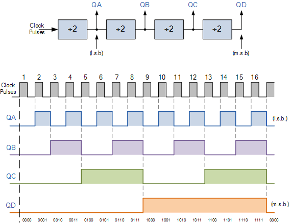
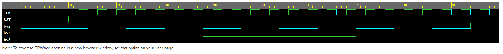

<h1 align="center"><b>Clock Divider</b></h1>

# What Is A Clock Divider?  
Clock divider is a circuit that produces lower frequency clock signal from input clock signal.The frequency division ratio is determined by a binary counter that counts the input clock cycles and generates an output signal every N cycles.
The duty cycle of the output signal depends on the circuit implementation and the value of N .
# Why Use It?

Clock divider circuits are commonly used in digital systems to generate multiple clock signals with different frequencies from a single master clock signal. They are used in various applications such as memory interfaces, data communication interfaces, and processor interfaces.

For example, in a microcontroller, different peripherals may require different clock frequencies. By using a clock divider circuit, multiple peripherals can share a common clock source while operating at different frequencies. Additionally, clock divider circuits can also be used for power management purposes by reducing the frequency of the clock signals during periods of low activity to conserve energy.

# Logical Implementation

# Result Waveform 

# View Code at EDA PLAYGROUND
[Click Here](https://www.edaplayground.com/x/jHW_)
