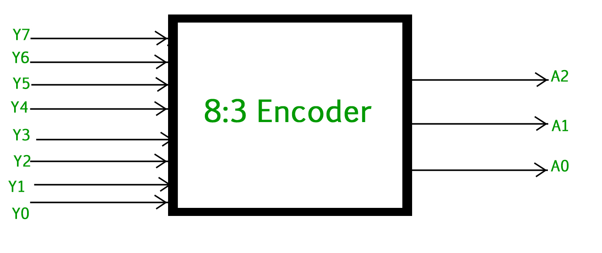
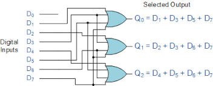
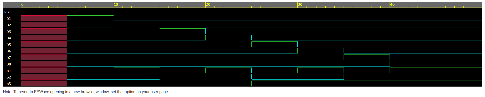

<h1 align="center"><b>8 to 3 Encoder</b></h1>

8 to 3 encoder is a cicuit that has 8 inputs and 3 outputs. The output is only generated when one and only one input is high. The encoder detects which input is active and produces a binary code on the output lines that represents the active input. 
No. of inputs =8  
No. of outputs=3  
The circuit will show error if the more than 2 inputs are high and also if all the inputs are low.

# Logic Circuit/Block Diagram

  

# Truth Table 
|D1|D2|D3|D4|D5|D6|D7|D8|  |O1|O2|O3|
|--|--|--|--|--|--|--|--|--|--|--|--|
|1|0|0|0|0|0|0|0|  |0|0|0|
|0|1|0|0|0|0|0|0|  |0|0|1|
|0|0|1|0|0|0|0|0|  |0|1|0|
|0|0|0|1|0|0|0|0|  |0|1|1|
|0|0|0|0|1|0|0|0|  |1|0|0|
|0|0|0|0|0|1|0|0|  |1|0|1|
|0|0|0|0|0|0|1|0|  |1|1|0|
|0|0|0|0|0|0|0|1|  |1|1|1|

# Logical Expressiom
O1= D4+D5+D6+D7 
O2= D2+D3+D6+D7 
O3= D1+D3+D5+D7 

# EDAPLAYGROUND LINK
[PLAY](https://www.edaplayground.com/x/cV_H)

# Result Waveform 

