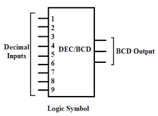

<h1 align="center"><b>Decimal to BCD(Binary Coded Decimal) Encoder</b></h1>

Decimal to BCD encoder is a digital circuit that converts a decimal number to its binary-coded decimal (BCD) equivalent. BCD is a binary encoding of decimal numbers where each decimal digit is represented by its binary equivalent. The Decimal to BCD encoder is a combinational circuit that takes a decimal input and generates a four-bit BCD output. This circuit is widely used in digital systems that require decimal arithmetic, such as calculators, clocks, and displays. The Decimal to BCD encoder can be implemented using various logic gates, such as AND, OR, and XOR gates, or using multiplexers. The circuit is easy to implement and requires fewer components, making it a popular choice for digital designers. By converting decimal numbers to BCD, the Decimal to BCD encoder enables digital systems to perform arithmetic operations, display numerical data, and perform other operations that require decimal representation. 
No. of inputs =10  
No. of outputs=4  

# Logic Circuit/Block Diagram

# Truth Table 
|D0|D1|D2|D3|D4|D5|D6|D7|D8|D9|  |A|B|C|D|
|--|--|--|--|--|--|--|--|--|--|--|-|-|-|-|
|1|0|0|0|0|0|0|0|0|0|  |0|0|0|0|
|0|1|0|0|0|0|0|0|0|0|  |0|0|0|1|
|0|0|1|0|0|0|0|0|0|0|  |0|0|1|0|
|0|0|0|1|0|0|0|0|0|0|  |0|0|1|1|
|0|0|0|0|1|0|0|0|0|0|  |0|1|0|0|
|0|0|0|0|0|1|0|0|0|0|  |0|1|0|1|
|0|0|0|0|0|0|1|0|0|0|  |0|1|1|0|
|0|0|0|0|0|0|0|1|0|0|  |0|1|1|1|
|0|0|0|0|0|0|0|0|1|0|  |1|0|0|0|
|0|0|0|0|0|0|0|0|0|1|  |1|0|0|1|

# Logical Expressiom
A=D8+D9 
B= D4+D5+D6+D7 
C= D2+D3+D6+D7 
D= D1+D3+D5+D7+D9 

# EDAPLAYGROUND LINK
[PLAY](https://www.edaplayground.com/x/RbCK)

# Result Waveform 

