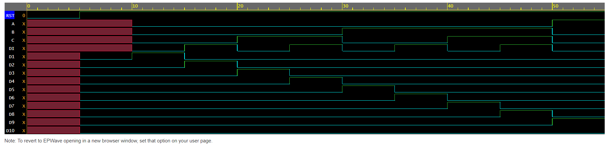

<h1 align="center"><b>Decimal to BCD(Binary Coded Decimal) Encoder</b></h1>

Decimal to BCD encoder is a cicuit that has 10 inputs and 4 outputs. The output is only generated when one and only one input is high. The encoder detects which input is active and produces a binary code on the output lines that represents the active input. 
No. of inputs =10  
No. of outputs=4  
The circuit will show error if the more than 2 inputs are high and also if all the inputs are low.

# Logic Circuit/Block Diagram

# Truth Table 
|D0|D1|D2|D3|D4|D5|D6|D7|D8|D9|  |A|B|C|D|
|--|--|--|--|--|--|--|--|--|--|--|-|-|-|-|
|1|0|0|0|0|0|0|0|0|0|  |0|0|0|0|
|0|1|0|0|0|0|0|0|0|0|  |0|0|0|1|
|0|0|1|0|0|0|0|0|0|0|  |0|0|1|0|
|0|0|0|1|0|0|0|0|0|0|  |0|0|1|1|
|0|0|0|0|1|0|0|0|0|0|  |0|1|0|0|
|0|0|0|0|0|1|0|0|0|0|  |0|1|0|1|
|0|0|0|0|0|0|1|0|0|0|  |0|1|1|0|
|0|0|0|0|0|0|0|1|0|0|  |0|1|1|1|
|0|0|0|0|0|0|0|0|1|0|  |1|0|0|0|
|0|0|0|0|0|0|0|0|0|1|  |1|0|0|1|

# Logical Expressiom
A=D8+D9 
B= D4+D5+D6+D7 
C= D2+D3+D6+D7 
D= D1+D3+D5+D7+D9 

# EDAPLAYGROUND LINK
[PLAY](https://www.edaplayground.com/x/RbCK)

# Result Waveform 

