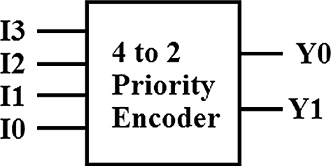
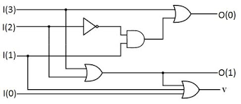
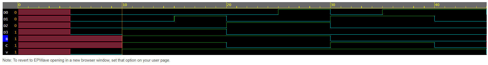

<h1 align="center"><b>4 TO 2 Priority Encoder</b></h1>

Priority encoder overcomes the limitations of basic encoder that is they have a output defined when all the inputs are zero and also they dont show error when more than input as they check the priority of the input to determine the output sequence.
 No. of inputs =4  
No. of outputs=3  

# Logic Circuit/Block Diagram

# Truth Table 
|D0|D1|D2|D3|  |A |B |V | 
|--|--|--|--|--|--|--|--|
|0|0|0|0| |X|X|0| 
|1|0|0|0| |0|0|1|
|0|1|0|0| |0|1|1|
|0|0|1|0| |1|0|1|
|0|0|0|1| |1|1|1|

# Logical Expressiom
B= D3+D2+D1 
A= D3+D2 
V= D0+D1+D2+D3 

# EDAPLAYGROUND LINK
[PLAY](https://www.edaplayground.com/x/ZGFb)

# Result Waveform 

